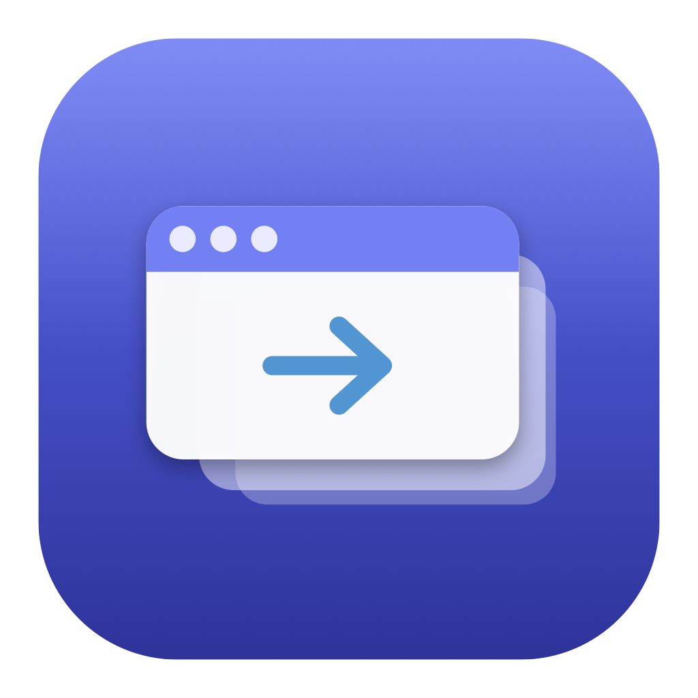

<div align="center">



# OpenTab

**A window switcher for macOS.**

Hold a key, see every window you have open, release to jump to one.

[](https://github.com/htopo/open-tab/actions/workflows/ci.yml)
[](LICENSE)


</div>

---

## What it does

macOS's built-in ⌘Tab switches between **applications**. If you have three
browser windows open, that is one entry, and getting to the right window means
tabbing to the app and then hunting with ⌘\` or Mission Control.

OpenTab switches between **windows**:

- **Every window is an entry.** Three browser windows are three entries.
- **Live thumbnails**, so you pick by looking rather than by reading titles.
- **Minimized, hidden, and other-Space windows are included** — they are usually
  exactly the ones you are looking for.

It replaces ⌘Tab by default, and hands the shortcut back when you quit.

## Install

```sh
brew install --cask htopo/tap/open-tab
```

Or download the DMG from [Releases](https://github.com/htopo/open-tab/releases)
and drag OpenTab to Applications.

> **OpenTab is signed but not notarized.** Notarization requires a paid Apple
> Developer ID, which this project does not have. Installing via the Homebrew tap
> handles this for you. If you download the DMG directly, macOS will refuse the
> first launch — right-click the app and choose **Open**, or run
> `xattr -dr com.apple.quarantine /Applications/OpenTab.app`. This is a one-time
> step, and it is the honest cost of a free app with no developer account behind
> it.

**Requires macOS 14 (Sonoma) or later.**

## Permissions

| Permission | Required? | Why |
|---|---|---|
| **Accessibility** | Yes | Listing windows, focusing them, and observing the hotkey. |
| **Screen Recording** | No | Thumbnails only. Without it OpenTab shows app icons and works normally. |

OpenTab walks you through both on first launch. Full detail, including why the
app is not sandboxed, is in [docs/PERMISSIONS.md](docs/PERMISSIONS.md).

## Using it

Hold **⌘** and press **Tab**.

- Keep holding ⌘ and press Tab again to move forward; tap ⇧ to move back.
  (Prefer ⇧Tab? Turn off *Controls → Additional controls → Shift steps
  backwards*.)
- Arrow keys navigate the grid; the mouse works too.
- Release ⌘ to focus the highlighted window.
- **Esc** cancels without switching.
- A quick ⌘Tab tap — faster than the hold threshold — swaps straight to your
  previous window with no visible panel, exactly like the system switcher.

While the switcher is open: **⌘W** closes the selected window, **⌘M** minimizes
it, **⌘H** hides its app, **⌘Q** quits its app, **⌘F** toggles fullscreen. All
rebindable.

Start typing to filter by name.

## Configuring it

Settings has four panes:

- **Appearance** — three switcher styles (thumbnails, app icons, titles), size,
  theme, multi-display placement, animations, and detailed layout controls.
- **Controls** — up to nine independent shortcuts, each with its own filtering,
  appearance, and ordering rules. An opt-in trackpad gesture.
- **General** — start at login, menu-bar icon, background capture, language,
  updates, import/export.
- **Exceptions** — per-app rules. Remote-desktop and VM clients ship configured to
  pass ⌘Tab through to the guest OS.

Every feature is free. There is no paid tier, no trial, and no telemetry.

## Building from source

Requires macOS 14+ and Swift 6.1+. **Xcode is not needed** — Command Line Tools
are enough; there is no `.xcodeproj`.

```sh
git clone https://github.com/htopo/open-tab.git
cd open-tab

# One-time: create a stable signing identity so macOS does not reset your
# Accessibility grant on every rebuild.
Scripts/make-signing-cert.sh

Scripts/bundle.sh            # → dist/OpenTab.app
open dist/OpenTab.app
```

Other targets:

```sh
swift test                    # unit tests; no permissions required
Scripts/bundle.sh --debug     # faster iteration builds
Scripts/bundle.sh --universal # arm64 + x86_64
Scripts/dmg.sh                # → dist/OpenTab-<version>.dmg
swift Scripts/make-icon.swift # regenerate the app icon from source
```

Releases are documented in [Packaging/README.md](Packaging/README.md).

Layout:

| Target | What lives there |
|---|---|
| `OpenTabAX` | Accessibility wrappers and runtime resolution of undocumented system symbols |
| `OpenTabCore` | Window model, registry, ordering, filtering, exceptions, settings |
| `OpenTabShot` | ScreenCaptureKit thumbnail capture and caching |
| `OpenTabInput` | Event tap, hotkey state machine, symbolic-hotkey ownership |
| `OpenTabUI` | SwiftUI overlay, settings, and onboarding views |
| `OpenTab` | App delegate, menu-bar item, overlay panel host, wiring |

The only third-party dependency is [Sparkle](https://sparkle-project.org), for
in-app updates. Everything else is Apple frameworks.

## Something went wrong

[docs/TROUBLESHOOTING.md](docs/TROUBLESHOOTING.md) covers the common cases. The
one worth knowing about in advance:

> **If ⌘Tab ever stops working entirely**, relaunching OpenTab repairs it. Taking
> over ⌘Tab means disabling the system's reservation of that key, and that change
> outlives the app — so OpenTab records what it disabled *before* disabling it and
> repairs a dirty state on the next launch. Manual recovery is documented too.

## Contributing

Issues and pull requests are welcome. Please run `swift test` before opening a PR,
and work through the relevant sections of [docs/QA.md](docs/QA.md) for anything
touching the switcher itself — most of this app's surface cannot be covered by
unit tests.

## License

MIT — see [LICENSE](LICENSE).

All code in this repository is original work written against public Apple APIs,
plus a small, documented set of undocumented CoreGraphics symbols that are
resolved at runtime and individually degrade to a fallback when unavailable. The
application icon and all other assets are original.
